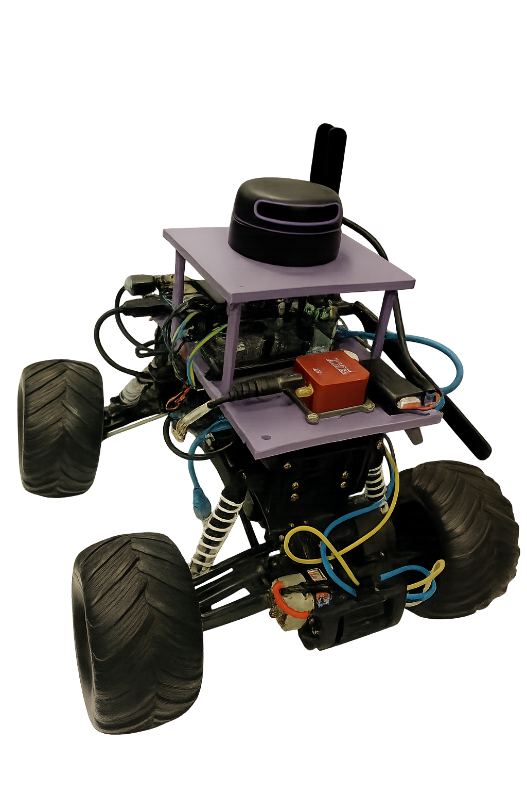

# LoRa-Based-RTK
Bitirme Projesi
## İçindekiler

- <a href="#proje-hakkında" style="color: white; font-weight: bold;"><b>Proje Hakkında</b></a>  
- <a href="#branchler" style="color: white; font-weight: bold;"><b>Branch’ler</b></a>  
- <a href="#gereksinimler" style="color: white; font-weight: bold;"><b>Gereksinimler</b></a>  
- <a href="#katkıda-bulunanlar" style="color: white; font-weight: bold;"><b>Katkıda Bulunanlar</b></a>

## Proje Hakkında
Bu proje, kapalı alanlarda GPS kaynaklı lokalizasyon sorunlarına çözüm olarak uzak mesafelere iletişim için kullanılan LoRa modülü ile baz istasyonuna olan uzaklık hesaplanarak lokalizasyon problemini çözmeyi hedefler.

    

## Branch’ler

- <a href="https://github.com/tolgaSelimoglu/LoRa-Based-RTK/tree/DEV/Simulation" style="color: white; font-weight: bold;"><b>Dev/Simulation</b></a>  
→ Simülasyon ortamını barındırır. MATLAB/Python script’leri ile LoRa kanal karakteristikleri, paket kayıpları ve RTK gecikme etkileri test edilir.

- <a href="https://github.com/tolgaSelimoglu/LoRa-Based-RTK/tree/Documents" style="color: white; font-weight: bold;"><b>Documents</b></a>   
  → Proje dokümantasyon dosyaları (Tasarım dokümanları, kullanım kılavuzları, şemalar ve şematik diyagramlar).  

- <a href="https://github.com/tolgaSelimoglu/LoRa-Based-RTK/tree/jetson_ws" style="color: white; font-weight: bold;"><b>jetson-ws</b></a>   
  → NVIDIA Jetson Nano üzerinde çalışan ROS workspace’i. `rtk_comm`, `lora_bridge` ve `navigation` paketlerini içerir.  

- <a href="https://github.com/tolgaSelimoglu/LoRa-Based-RTK/tree/main" style="color: white; font-weight: bold;"><b>main</b></a>    
  → Kararlı (stable) sürüm kodları. Üretim ortamına deploy edilebilecek haliyle Rover ve Base Station uygulamaları.  

## Gereksinimler

- Python >= 3.8
- ROS Noetic ( <a href="  https://github.com/tolgaSelimoglu/LoRa-Based-RTK/tree/jetson_ws" style="color: white; font-weight: bold;"><b>jetson-ws</b></a>   )

## Katkıda Bulunanlar

- <a href="https://www.linkedin.com/in/tolga-selimoglu/" style="color: white; font-weight: bold;"><b>Tolga Selimoğlu</b></a>
- <a href="https://www.linkedin.com/in/muhammed-saidnur-%C3%A7al%C4%B1%C5%9Fkan-7b03b8200/" style="color: white; font-weight: bold;"><b>Muhammed Saidnur Çalışkan</b></a>
- <a href="https://www.linkedin.com/in/sametburhan/" style="color: white; font-weight: bold;"><b>Samet Burhan</b></a>

### Danışman
- <a href="https://avesis.yildiz.edu.tr/aydiny" style="color: white; font-weight: bold;"><b>Aydın Yeşildirek</b></a>

